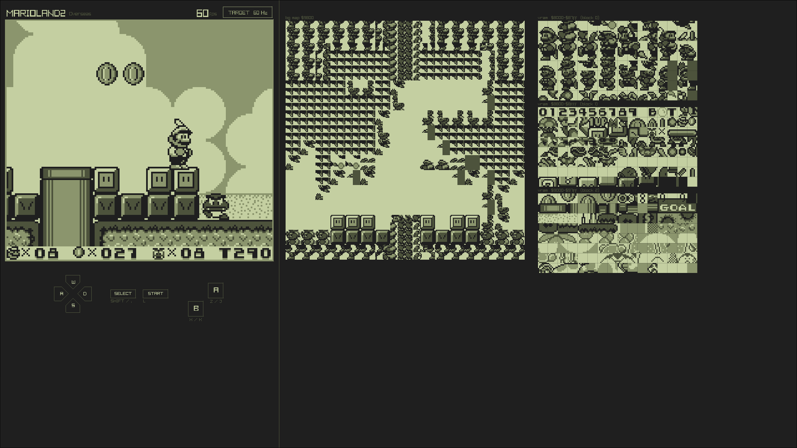

# gbeed
WIP DMG Game Boy emulator for embedded devices. This project aims to provide a simple DMG Game Boy emulator that can run both over a graphical session and in a DRM/KMS environment, in a normal x86-64 Linux pc or in a Raspberry Pi Zero running Linux. To allow this it'll use raylib as a library to deal with graphics, input and audio.



## Status
### Games
Core emulator is mostly complete, not including audio and game saving. Some games are playable, but others crash the emulator or have severe slowdowns.

| Game                   | Cartridge Type                  | ROM Size | ROM Banks | RAM Size | RAM Banks | Playable           |
|------------------------|---------------------------------|----------|-----------|----------|-----------|--------------------|
| Tetris                 | ROM Only                        | 32 KB    | 2         | None     | 0         | Playable           |
| SML                    | MBC1                            | 64 KB    | 4         | None     | 0         | Not Playable       |
| SML2                   | MBC1 + RAM + Battery            | 512 KB   | 32        | 8 KB     | 1         | Playable           |
| Pokémon Red            | MBC3 + RAM + Battery            | 1024 KB  | 64        | 32 KB    | 4         | Severe slowdown    |
| Pokémon Gold           | MBC3 + Timer + RAM + Battery    | 2048 KB  | 128       | 32 KB    | 4         | Playable           |
| Link's Awakining       | MBC1 + RAM + Battery            | 512 KB   | 32        | 8 KB     | 1         | Crash the emulator |

### Tests
The emulator is tested using [Blargg's rom test](https://github.com/retrio/gb-test-roms) and [Mooneye test suite](https://github.com/Gekkio/mooneye-test-suite) and passes basic CPU instructions and MBC tests, but fails most of the timing tests. See passed tests in `core/tests`.

## How to use
### Dependencies
This project uses `nix` flakes, and are the recommended way to manage dependencies. If installed and properly configured, using the project should be as easy as:
```sh
nix develop .
just run -- <game_rom> <boot_rom>   # just passes flags directly to cargo adding necessary features
```

If flakes are not enabled, you can use:
```sh
nix develop --experimental-features "nix-command flakes" .
```

If you have `direnv` installed and configured, just entering the project directory will automatically load the development environment after the first `direnv allow`
```sh
> direnv: error .envrc is blocked. Run `direnv allow` to approve its content
direnv allow
just run -- <game_rom> <boot_rom>
```

If you're not using nix, the dependencies must be installed manually, and according to the wanted environment. All dependencies are listed in the `flake.nix` file. For example, if you're using Debian in x11, you will need to install the rust toolchain with `rustc >= 1.91.1` and the raylib dependencies
```sh
# rust toolchain, recommended way is using rustup to manage rust versions
curl --proto '=https' --tlsv1.2 -sSf https://sh.rustup.rs | sh

# raylib dependencies
sudo apt install build-essential cmake clang git libasound2-dev libx11-dev libxrandr-dev libxi-dev libgl1-mesa-dev libglu1-mesa-dev libxcursor-dev libxinerama-dev libxkbcommon-dev libdrm-dev libgbm-dev
```

To build and run the project without just, in x11 you can just `cargo run -- <game_rom> <boot_rom>`, but in other environments you will need the to add the corresponding features, as are used in `justfile`.

### Display environments
The flake exposes three different shells for different display environments. Direnv will check some environment variables to automatically select the right shell, but you can also manually select the shell this way:
- `x11`: `nix develop .#x11`
- `wayland`: `nix develop .#wayland`
- `drm`: `nix develop .#drm`

The default shell is `x11`, because will at least run in wayland sessions too using xwayland.
DRM support works in both AMD and ARM GPU. In Nvidia both `opengl_es_20` and `opengl_es_30` segfault at init (`dic 20 13:12:41 stoneward kernel: gbeed[6765]: segfault at 0 ip 00007fa29f9b4d31 sp 00007fff9c2052d0 error 4 in libnvidia-egl-gbm.so.1.1.2[1d31,7fa29f9b4000+3000] likely on CPU 0 (core 0, socket 0)`).

### How to run tests
To run the tests, you can use just:
```sh
just test
```

The boot rom test needs a valid dmg boot rom file to run in the project root, named `dmg_boot.bin` 
