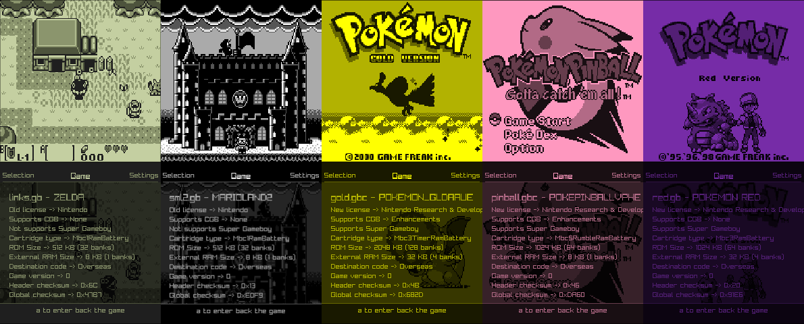

# gbeed
DMG Game Boy emulator for embedded devices. This project aims to provide a simple DMG Game Boy emulator that can run both over a graphical session and in a DRM/KMS environment, in a normal x86-64/arm Linux pc or in a Raspberry Pi Zero running Linux.

This project consists of the emulator core and two emulator frontends made with [raylib](https://www.raylib.com/), that deals with graphics, input and audio.
The [`console`](./frontends/console/) frontend is meant to be used in a Raspberry Pi Zero with a small display (using the raylib DRM backend).
The [`debugger`](./frontends/debugger/) frontend is meant to be used in a normal Linux graphical session, both X11 and Wayland, or in [the browser](https://daniqss.github.io/gbeed/) thanks to the WASM build.

### Recommended hardware
The recommended device is the **Raspberry Pi Zero 2 W**, as its `aarch64` architecture has full NixOS support, allowing us to provide a ready-to-use SD card image (see [below](#raspberry-pi-zero-2-sd-image)).

The original **Raspberry Pi Zero** (`armv6l`) is also supported, but only via a manually cross-compiled binary. NixOS does not support `armv6l` as a hosted system, so there is no managed image for it — device setup must be done manually (see [armv6l build](#how-to-build-for-armv6l-alpine-linux)).




## Status
### Games
Core emulator is mostly complete, and allow sufficintly good emulation in most games, besides some minor graphical glitches, with full speed in low-end devices such as a Raspberry Pi Zero. The last remaining core feature that is not implemented yet is audio emulation. The current PPU implementation is a scanline-based, so the few games that rely on more accurate PPU timing may have problems.

The following games, the best-selling games of the DMG catalog, are tested in initial areas and are playable without major issues.

| Selling Ranking | Game               | Playable         | Cartridge Type                        | ROM Size | RAM Size |
|-----------------|--------------------|------------------|---------------------------------------|----------|----------|
| 1               | Pokémon Red        | 🟩 Playable      | GB MBC3 + RAM + Battery               | 1024 KB  | 32 KB    |
| 2               | Tetris             | 🟩 Playable      | GB ROM Only                           | 32 KB    | None     |
| 3               | Pokémon Gold       | 🟩 Playable      | GBC MBC3 + Timer + RAM + Battery      | 2048 KB  | 32 KB    |
| 3               | Pokémon Crystal    | 🟩 Not Supported | GBC Only MBC3 + Timer + RAM + Battery | 2048 KB  | 32 KB    |
| 4               | Super Mario Land   | 🟩 Playable      | GB MBC1                               | 64 KB    | None     |
| 5               | Super Mario Land 2 | 🟩 Playable      | GB MBC1 + RAM + Battery               | 512 KB   | 8 KB     |
| 7               | Pokemon Pinball    | 🟩 Playable      | GBC MBC5 Rumble + RAM + Battery       | 1024 KB  | 8 KB     |
| 11              | Link's Awakining   | 🟩 Playable      | GB MBC1 + RAM + Battery               | 512 KB   | 8 KB     |


## How to use
This project uses `nix` flakes, and are the recommended way to manage dependencies. If installed and properly configured (flakes enabled or using `--experimental-features "nix-command flakes"`), using the project should be as easy as:
```sh
# you can choose between `x11`(the default one), `wayland`, `drm`
nix develop .
# nix develop .#wayland

# to run the `console` frontend
just

# to run the `debugger` frontend
just run -p gbeed-debugger

# to run the `debugger` frontend passing game and optionally boot rom from cli
just run -p gbeed-debugger -- -g <game_rom> -b <boot_rom>
```

- If flakes are not enabled, you can use `nix develop --experimental-features "nix-command flakes" .`
- If you have `direnv` installed and configured, just entering the project directory will automatically load the correct development shell after the first `direnv allow`.
- `just` passes the correct features to `cargo` for each display environment.


### DRM/KMS support
DRM support is tested in Intel, AMD and Broadcom iGPUs. In Nvidia (specifically GTX 1660 with drivers version 580) both `opengl_es_20` and `opengl_es_30` raylib features segfault at init (`dic 20 13:12:41 stoneward kernel: gbeed[6765]: segfault at 0 ip 00007fa29f9b4d31 sp 00007fff9c2052d0 error 4 in libnvidia-egl-gbm.so.1.1.2[1d31,7fa29f9b4000+3000] likely on CPU 0 (core 0, socket 0)`).

### How to build a Raspberry Pi Zero 2 SD image
The easiest way to run gbeed in a console format is on a Raspberry Pi Zero 2 W. This project offers a ready-to-use NixOS SD image built from this repository. The image boots directly into gbeed — no installer, no manual setup.

Build the image (requires `aarch64-linux` or cross-compilation support configured in your Nix setup):
```sh
nix build github:daniqss/gbeed#installerImages.gbeed02
```

Flash it to your SD card:
```sh
sudo dd if=./result/sd-image/*.img of=/dev/<SD_CARD_DEVICE> bs=4M status=progress conv=fsync && sync
```

On first boot, the system starts directly into `gbeed`. ROMs should be placed at `/home/gbeed/roms/` (`.gb` and `.gbc` files). The system is also accessible over SSH on the local network once WiFi is configured via `iwctl`.

> **Note:** WiFi credentials must be configured before or after flashing. Connect a keyboard and run `iwctl` to join a network, or provide a pre-configured `iwd` profile in `/var/lib/iwd/` after mounting the SD card.

### How to build for armv6l Alpine Linux
The easiest way to build the project for armv6l is through cross-compilation on x86_64/aarch64. This is done via a podman or docker container and qemu using  the provided `Dockerfile.cross`. This provides a fully isolated build environment.

You can easily do this with `just`:
```sh
just crossbuild
```

This will:
1. Install the `arm` binfmt if needed.
2. Build the project inside an `arm32v6/alpine` container.
3. Extract the resulting binary as `./gbeed-armv6l`.

### How to run tests
To run the tests, you can use just:
```sh
just test
```

The boot rom test needs a valid dmg boot rom file to run in the project root, named `dmg_boot.bin` 
## Tests
The emulator is tested using [Blargg's rom test](https://github.com/retrio/gb-test-roms) and [Mooneye test suite](https://github.com/Gekkio/mooneye-test-suite) and passes basic CPU instructions and MBC tests, but fails most of the timing tests. See passed tests in `core/tests`.

For PPU testing, gbeed passes [dmg-acid2](https://github.com/mattcurrie/dmg-acid2) test, so basic rendering is correct besides some minor issues and not fully accurate timing. This test must be run manually because it needs manual verification of the result.

To run the tests, you can use just:
```sh
just test
```

The boot rom test needs a valid dmg boot rom file to run in the project root, named `dmg_boot.bin`

## License
This project is licensed under the GPL-2.0 License. See [LICENSE](./LICENSE) for more details.

